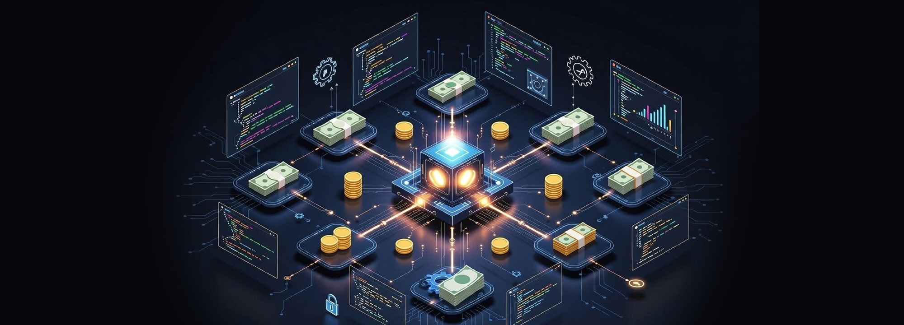

Automation developer focused on financial reconciliation and process reliability.

I design and implement automations that reduce manual effort, increase traceability, and minimize operational risk in financial and data-intensive workflows.

Primary areas of work:
- Financial reconciliation and data consistency checks
- Process automation using BotCity
- Workflow orchestration and system integration with n8n
- Data extraction, validation, and report generation

I prioritize clarity, control, and predictability in environments where errors have real financial impact.
